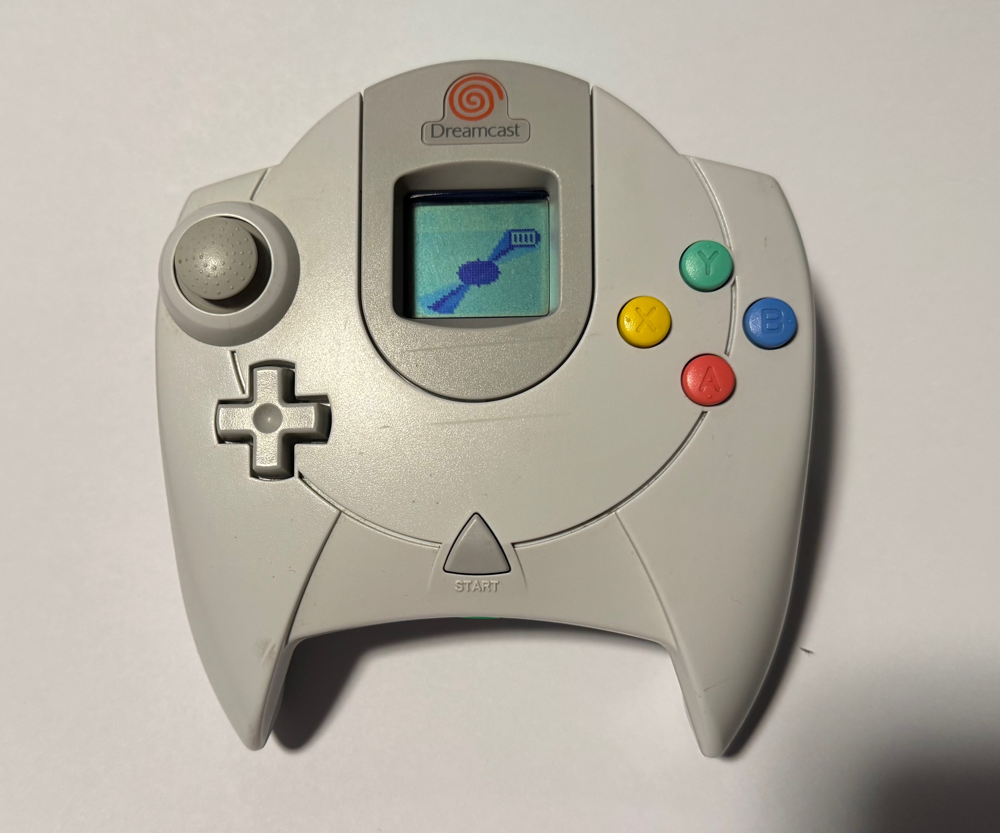
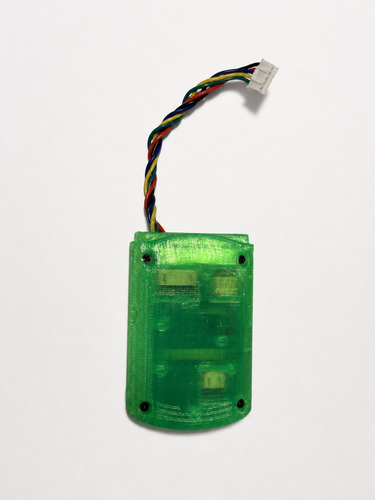
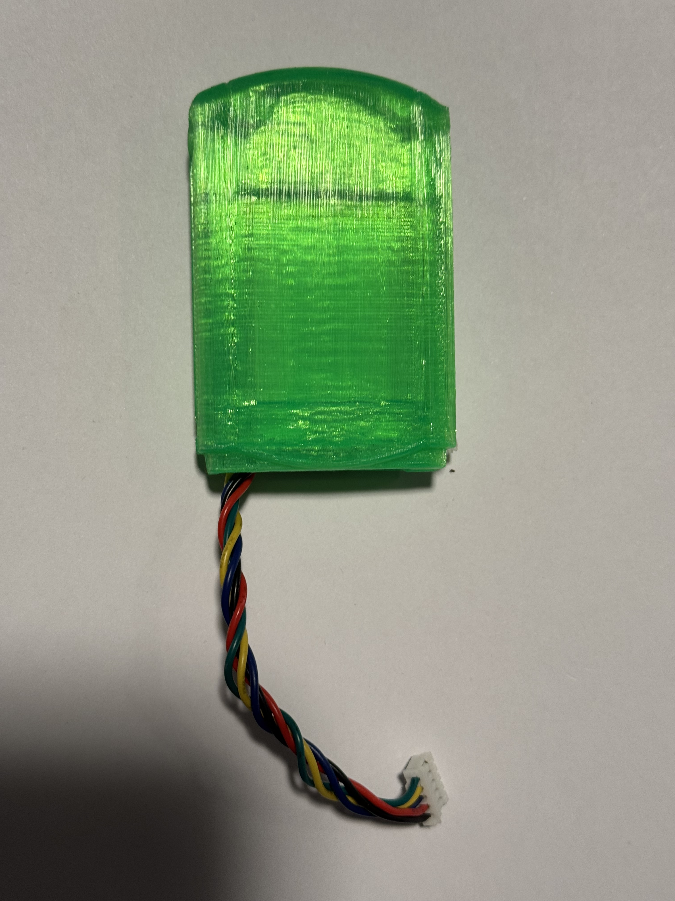

# Pulsar Dreamcast BLE

[](https://github.com/alwaysEpic/pulsar-dreamcast-ble/actions/workflows/ci.yml)
[](LICENSE)




Use your Dreamcast controller wirelessly with any Bluetooth device. Pulsar speaks the Dreamcast's Maple Bus protocol natively and presents itself as a standard Xbox One S BLE gamepad — just plug in, pair, and play.

### ⚡ [**Buy Pulsar — Dreamcast wireless controller adapter**](https://pulsar.alwaysagog.com/buy)

A complete wireless Dreamcast controller, Pulsar on its own, or the parts to build one —
at **[pulsar.alwaysagog.com](https://pulsar.alwaysagog.com/)**. Prefer to build it
yourself? [Start here](docs/build/xiao.md); everything you need is in this repo.

> **Where to get Pulsar firmware.** The only official sources are this repository's
> [Releases](https://github.com/alwaysEpic/pulsar-dreamcast-ble/releases) page and the
> updater at [pulsar.alwaysagog.com/update](https://pulsar.alwaysagog.com/update).
> Firmware ships as `.uf2`, `.hex`, or a signed OTA package — never as a `.zip`, `.exe`, or
> anything you run on a PC. Copies of this repo on other GitHub accounts that offer a
> "download" have been found carrying malware. Don't run them.

## Features

- All Dreamcast inputs: A/B/X/Y, Start, D-pad, analog stick, analog triggers
- Guide/Xbox button via a trigger + Start chord (opens the Steam overlay, Game Bar, etc.)
- Works with any BLE HID host (PC, iOS, Android, Switch, Dreamcast via iBlueControlMod)
- Two switchable identities for broad host compatibility: **Xbox** (default), or a plain **generic BLE HID gamepad** (labeled "Dreamcast" — neutral identity, not controller emulation)
- VMU LCD display: profile splash, rotating pulsar with battery indicator, mode splashes
- 60Hz controller polling with continuous BLE reporting
- Pairing persists across power cycles (flash-based bonding)
- Battery powered (~7-8 hrs on 500mAh, ~14-16 hrs on 1000mAh) with sleep/wake support
- 3D-printable VMU-shaped enclosure included

## Compatibility

### Controllers
- Standard Dreamcast controller (first-party tested)

### Hosts

**Tested:**
- Steam Deck (as Xbox gamepad)
- macOS — browser + Steam (as Xbox gamepad)
- Windows — Steam (as Xbox gamepad)
- Linux — xpadneo (as Xbox gamepad)
- Dreamcast (via [iBlueControlMod](https://handheldlegend.com/products/dreamcast-ibluecontrolmod-bluetooth-mod) adapter)

**Should work (untested):**
- iOS, Android (as BLE HID gamepad)
- PlayStation, Nintendo Switch (as generic controller)

## Supported Boards

One firmware, three boards. They play identically; what differs is what they can show you and
how you flash them.

| Board | | Status light | Battery | Rumble | Flashing |
|---|---|---|---|---|---|
| **XIAO** | Hand-wired DIY build — the one this guide walks through | Onboard RGB | Voltage estimate | — | USB (UF2) |
| **Pulsar v1** | Designed carrier with a XIAO mounted on it | 5-LED bar (status + battery) | IP5306 gauge, 4 levels | Yes | Wireless (OTA) |
| **DK** | nRF52840-DK, bench only | Kit LEDs | — | — | Debug probe |

Pulsar v1 runs the same XIAO module as the DIY build, so the two share their silicon — the
carrier adds integrated power management, the LED bar, and a rumble motor around it. Its
fabrication files are not published, but the design is described in the
[bill of materials](docs/bill_of_materials.md) and all three boards' pin assignments are in
[pin mapping](docs/pin_mapping.md).

## Three paths — pick yours

Each board has its own guide, written to be followed start to finish.

| | Guide | For |
|---|---|---|
| 🔧 | **[Build the XIAO adapter](docs/build/xiao.md)** | The hand-wired DIY build. Perfboard, a boost converter, two resistors and two diodes. Soldering required, and it permanently modifies a controller |
| 🧪 | **[Bench setup on an nRF52840-DK](docs/build/dk.md)** | Development and debugging. No soldering, and no permanent change to a controller if you cut an extension cable instead |
| 📦 | **[Install an assembled Pulsar v1](docs/build/pulsar-v1.md)** | You bought one. Photo-by-photo: open the controller, fit Pulsar, route the cable, close it up |

Once it is together, the [user guide](docs/users_guide.md) covers all three boards, and
Pulsar v1 owners have a dedicated [owner's manual](docs/pulsar_v1_manual.md).

## Build Your Own

A summary of the **XIAO** build. The step-by-step version — cable identification, the 5 V
diode-OR, pre-power checks and first-boot behaviour — is in
**[docs/build/xiao.md](docs/build/xiao.md)**.

### What You Need

- Seeed XIAO nRF52840
- Dreamcast controller
- 5V boost converter (for battery mode)
- 2x 10kΩ resistors
- LiPo battery
- USB cable (for UF2 flashing) or debug probe (for development)

See the full [bill of materials](docs/bill_of_materials.md) for details.

### Wiring


Connect SDCKA and SDCKB from the controller cable to the XIAO with 10kΩ pull-ups to 3.3V. The controller needs 5V power via a diode OR circuit (USB + boost converter). See [pin mapping](docs/pin_mapping.md) for the complete wiring reference.

> **Meter your cable before you solder.** The colour-to-pin table is the canonical Maple
> pinout, not a promise about the cable in your hand — third-party and later-revision
> controllers differ, and getting it wrong puts 5 V on a data line. The
> [build guide](docs/build/xiao.md#2-identify-the-cable-conductors) walks through checking
> it with a multimeter, and explains why the diode OR is there and which way round the
> diodes go.

### Flash

Pre-built firmware is available on the [Releases](https://github.com/alwaysEpic/pulsar-dreamcast-ble/releases) page.

**UF2 (recommended — no debug probe needed):**

The XIAO ships with a UF2 bootloader that includes the Nordic SoftDevice. Just double-tap the reset button — the board mounts as a USB drive (`XIAO-BOOT`) — then copy the `.uf2` file:

```bash
cp pulsar-dreamcast-ble-xiao.uf2 /Volumes/XIAO-BOOT/
```

The board auto-resets and runs the firmware.

**SWD (for development — requires J-Link or nRF52840 DK):**

If you need RTT debug logging, flash via SWD instead. The SoftDevice must be flashed separately first — see [flash commands](docs/flash-commands.md) for the full workflow.

### Pair and Play

1. Power on the adapter — it starts advertising immediately
2. On your host device, scan for **"Xbox Wireless Controller"**
3. Pair and you're done — bonding is saved automatically

**Sync button:**
- Short press → wake / request reconnect
- Hold 2s → clear bond and start pairing
- Hold 3.5s **while holding the controller's Start** → firmware update (OTA) mode
- Tap, tap, then hold 3.5s → the same update mode, no controller needed
- **Tap once, then hold 3.5s → browser configuration mode ([remap your buttons](docs/users_guide.md#remapping-buttons-from-your-browser))**
- Hold 7s → sleep (`BYE` splash, then powers off)
- Triple-press → switch profile (Xbox ⇄ Dreamcast identity)

**Guide / Xbox button:** pull both triggers and hold Start (~⅓ second) to send the Guide button — opens the Steam overlay / Big Picture, the Xbox Game Bar, etc. Works on both profiles.

The VMU LCD shows the active profile on connect, a rotating pulsar with battery indicator while in use, a home icon when you press the Guide chord, and splashes for pairing (`SYNC`) and sleeping (`BYE`).

<p align="center"></p>

See the [user guide](docs/users_guide.md) for all screens, profile choice, and troubleshooting.

### Enclosure

A 3D-printable VMU-shaped case is included in [`3d_files/`](3d_files/). See [3d_files/README.md](3d_files/README.md) for print tips and attribution.

<table>
  <tr>
    <td></td>
    <td></td>
  </tr>
  <tr>
    <td></td>
    <td></td>
  </tr>
</table>

## For Developers

### Building from Source

Requires Rust stable with `thumbv7em-none-eabihf` target:

```bash
rustup target add thumbv7em-none-eabihf
cargo install cargo-embed
```

**XIAO** (must use `--release` — debug builds break Maple Bus timing):
```bash
# Production
cargo embed --release --no-default-features --features board-xiao

# Development (with RTT debug logging)
cargo embed --release --no-default-features --features board-xiao,rtt
```

**DK** (RTT always enabled):
```bash
cargo embed --release
```

**Pulsar v1** (ships as a signed OTA package; SWD is for bring-up only):
```bash
cargo build --release --no-default-features --features board-pulsarv1
```

Each board has a start-to-finish guide under [`docs/build/`](docs/build/).

### Testing

The `maple-protocol` crate is pure Rust with no embedded dependencies — tests run on the host:

```bash
cd maple-protocol && cargo test
```

### Architecture

The project is split into two crates:

- **`maple-protocol/`** — Pure protocol library: controller state parsing, packet construction, Xbox HID report generation. No hardware dependencies, fully host-testable.
- **`src/`** — Firmware: Maple Bus GPIO bit-banging, BLE stack (Nordic SoftDevice S140), board support, button handling, power management.

The GPIO implementation bulk-samples both data lines at ~7.9 MS/s (≈4 samples per 500 ns bit) to capture the 2 Mbps Maple Bus protocol, then decodes in software. This is an nRF52840-specific approach — other chips (e.g., RP2040 with PIO) could implement the same protocol differently. See [maple_bus_protocol.md](docs/maple_bus_protocol.md) for the full protocol reference.

### Running Checks

```bash
./scripts/ci.sh
```

Runs formatting, the protocol tests, clippy for all three boards, every release build, and
then checks each ELF's timing invariants. `./scripts/check.sh [dk|xiao|pulsarv1]` is the ~2 s
inner loop to run after every change; `ci.sh` is the gate before a commit.

## Documentation

[`docs/MOC.md`](docs/MOC.md) indexes everything. The main entries:

| Document | Description |
|----------|-------------|
| [Build guides](docs/build/) | One per board: [XIAO](docs/build/xiao.md), [DK](docs/build/dk.md), [Pulsar v1](docs/build/pulsar-v1.md) |
| [User Guide](docs/users_guide.md) | Using the adapter, across all three boards |
| [Owner's Manual](docs/pulsar_v1_manual.md) | For an assembled Pulsar v1 |
| [Bill of Materials](docs/bill_of_materials.md) | Parts list for building your own |
| [Pin Mapping](docs/pin_mapping.md) | Complete wiring reference for all three boards |
| [Flash Commands](docs/flash-commands.md) | Flashing and debugging cheat sheet |
| [Maple Bus Protocol](docs/maple_bus_protocol.md) | Protocol reference and implementation details |
| [Input Quality Testing](docs/input_quality_testing.md) | Measuring latency and packet loss |
| [Battery Optimization](docs/battery_optimization.md) | Power management strategy |
| [Learnings](docs/learnings.md) | Implementation lessons learned |

## Releases

Pre-built firmware is available on the [Releases](https://github.com/alwaysEpic/pulsar-dreamcast-ble/releases) page. Each release includes:

- **`pulsar-dreamcast-ble-xiao.uf2`** — XIAO firmware, drag-and-drop via UF2 bootloader
- **`pulsar-dreamcast-ble-xiao.hex`** — XIAO firmware, for flashing via J-Link/SWD
- **`pulsar-dreamcast-ble-dk.hex`** — DK firmware, for flashing via J-Link

3D scan archives are also attached to releases.

Pulsar v1 units update over the air from
[pulsar.alwaysagog.com/update](https://pulsar.alwaysagog.com/update); the packages are signed
and the device refuses anything else. There are no other download locations. If a copy of this
repo somewhere else offers a `.zip` or a Windows program, it isn't ours — see the note at the top.

## Contributing

Contributions are welcome! See [CONTRIBUTING.md](CONTRIBUTING.md) for build instructions, project structure, and how to submit changes.

## License

This project is licensed under the [GNU General Public License v3.0 or later](LICENSE). 3D model files have separate licensing — see [3d_files/README.md](3d_files/README.md).
