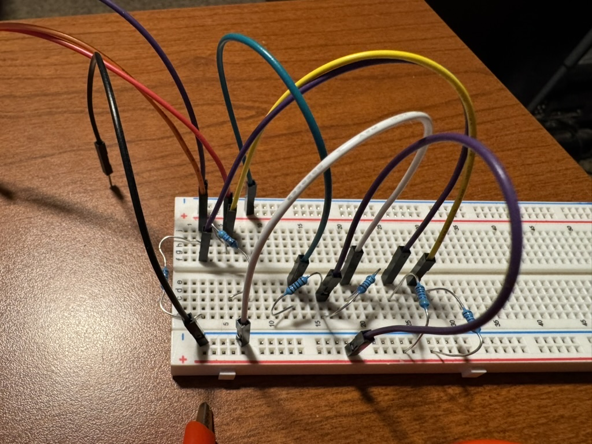

# Bench setup — nRF52840-DK

The development path. A Nordic nRF52840-DK, a breadboard, two resistors and a bench supply.
**No soldering and no permanent change to a controller** if you use a Dreamcast extension
cable rather than cutting the controller's own.

This is the board to use when you want to read RTT logs, attach a debugger, or work on the
firmware. It is not a board to play on: it has no battery, no rumble, and it halts where
the other boards sleep.

Other paths: [the hand-wired XIAO build](xiao.md) (the one you can actually play on) ·
[installing an assembled Pulsar v1](pulsar-v1.md).

---

## 1. What you need

| Part | Qty | Notes |
|---|---|---|
| nRF52840-DK | 1 | Built-in J-Link — no separate programmer |
| Dreamcast controller | 1 | First-party is the only one tested |
| Dreamcast extension cable | 1 | Cut *this* instead of the controller's own cable and the controller stays original |
| 10 kΩ resistor | 2 | Bus pull-ups. 4.7 kΩ also works |
| 5 V supply | 1 | **The DK only outputs 3.3 V** — see [§3](#3-the-controller-needs-5-v-from-somewhere-else) |
| Jumper wires | 4+ | |
| Breadboard | 1 | |



---

## 2. Wiring

Identify the five conductors **with a multimeter** before connecting anything — the colour
table is the canonical Maple pinout, not a promise about your cable. The full procedure is
in [the XIAO guide §2](xiao.md#2-identify-the-cable-conductors) and applies unchanged here.

| Cable pin | Typical colour | Function | Goes to |
|---|---|---|---|
| 1 | Red | SDCKA | DK **P0.05** |
| 2 | Blue | +5 V | external 5 V supply |
| 3 | Black | GND | DK GND **and** supply ground |
| 4 | Green | Sense (tied to ground) | GND |
| 5 | White | SDCKB | DK **P0.06** |

> **Note the pin difference.** SDCKB is **P0.06** on the DK but **P0.03** on the XIAO. The
> DK's P0.06 is otherwise the UART TX pin; the firmware takes it over.

Both data lines need a **10 kΩ pull-up to 3.3 V**, taken from the DK's 3.3 V rail — not
from the 5 V supply:

```
   3.3 V ──┬── 10 kΩ ──┬── DK P0.05 ── cable pin 1, SDCKA (red)
           │           │
           └── 10 kΩ ──┴── DK P0.06 ── cable pin 5, SDCKB (white)
```

Keep the two bus wires short and roughly equal. At 2 Mbps on a breadboard, long jumpers are
the usual reason a controller enumerates intermittently.

---

## 3. The controller needs 5 V from somewhere else

The DK's VDD rail is **3.3 V**, and a Dreamcast controller will not run on it. Unlike the
other two boards there is no onboard boost and no USB pass-through, so bring 5 V from a
bench supply or a USB breakout.

**Tie the grounds together.** The 5 V supply's ground, the DK's ground, and the cable's
ground (pins 3 and 4) must all be common, or the bus has no shared reference and nothing
works.

Before connecting the controller: check for a short between the 5 V rail and ground, and
confirm you read ~5 V where the blue conductor will land.

---

## 4. Board controls

| Function | Pin | On the kit |
|---|---|---|
| Sync button | P0.25 | **Button 4** |
| Sync LED | P0.13 | LED1 |
| Status | P0.14–P0.16 | LED2–LED4 |

Status reads differently here than on the other boards: searching is **LED4**, connected is
**LED3**, where the XIAO uses one RGB LED for both.

---

## 5. Build and flash

The DK is the **default** build target and always includes RTT logging.

```bash
rustup target add thumbv7em-none-eabihf
cargo install cargo-embed
```

The Nordic S140 SoftDevice v7.3.0 must be flashed once before the application
([download](https://www.nordicsemi.com/Products/Development-software/S140/Download)):

```bash
nrfjprog --eraseall
nrfjprog --program s140_nrf52_7.3.0_softdevice.hex --verify
```

Then, from the repo root:

```bash
cargo embed --release
```

`cargo embed` flashes and opens the RTT terminal. **`--release` is mandatory** — a debug
build misses the Maple timing window outright and will never talk to the controller. To
attach to a board that is already running:

```bash
probe-rs attach --chip nRF52840_xxAA \
  target/thumbv7em-none-eabihf/release/pulsar-dreamcast-ble
```

More recipes — GDB, panic-log readback, recovery from a locked chip — are in
[flash commands](../flash-commands.md).

### First boot

LED4 lights while the firmware looks for the controller; LED3 once it is talking. Scan for
**"Xbox Wireless Controller"** on your host and connect.

Unlike Pulsar v1, the DK powers the controller as soon as the rail is up — there is no
boost to gate, so you do not have to pair first.

---

## 6. What behaves differently here

Worth knowing before you file a bug against the DK:

- **It halts instead of sleeping.** The sleep paths that put the other boards into System
  Off stop the DK where it stands. Reset to recover.
- **No battery, no gauge.** Battery reporting is absent, not zero — hosts show no battery
  level.
- **No rumble.** There is no motor output on the kit.
- **The OTA update gesture does nothing useful.** Wireless update is a Pulsar v1 feature;
  reflash the DK with the probe.
- **RTT is always on**, which costs a little timing margin the production builds do not
  pay. That is deliberate for a bench board.

---

## 7. Working on the firmware

```bash
./scripts/check.sh dk    # after every change  — protocol tests + clippy
./scripts/ci.sh          # before every commit — fmt, all boards, all release builds
```

`ci.sh` also runs `check_timing_invariants.sh` against each built ELF, which reads the
compiled binary and fails if the pinned RX sampling loop has moved or lost its alignment.
If you touch anything under `src/maple/`, expect that check to have an opinion.

Background reading:

- [Maple bus protocol](../maple_bus_protocol.md) — the wire format, consolidated
- [Learnings](../learnings.md) — what 2 Mbps bit-banged GPIO on this part actually costs
- [Input quality testing](../input_quality_testing.md) — measuring latency and packet loss
- [Test plan](../test_plan.md) — the full adapter test plan
