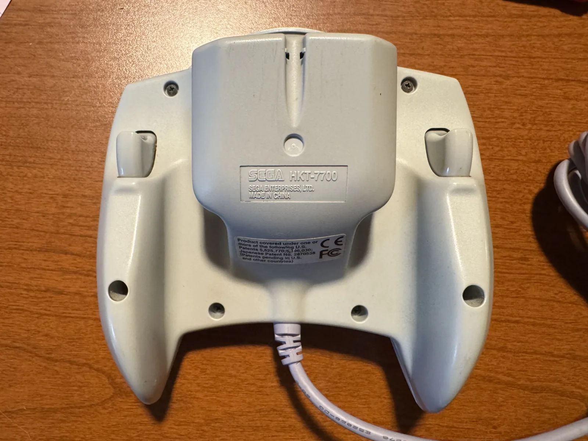
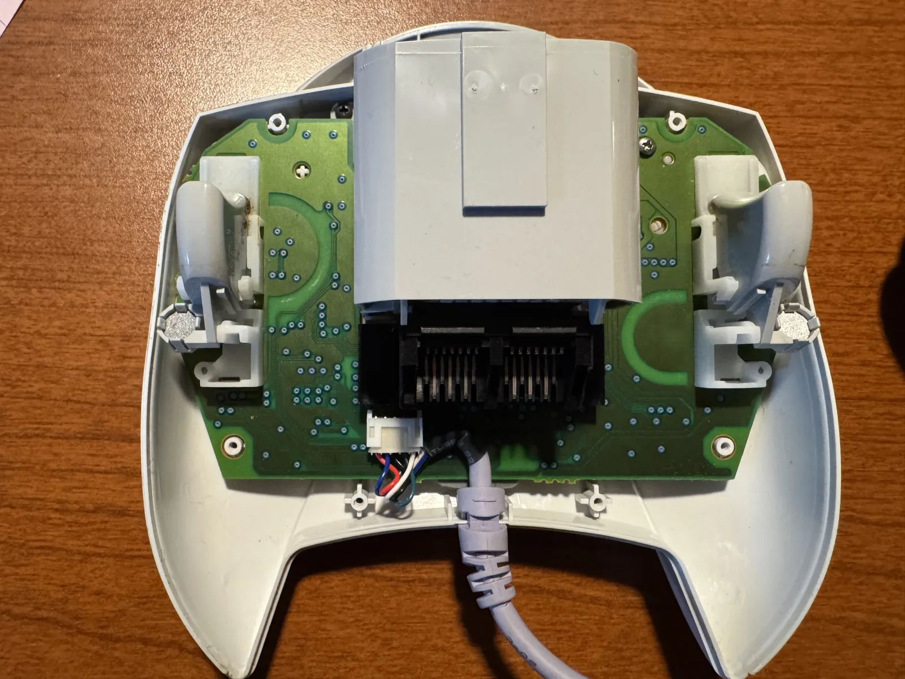
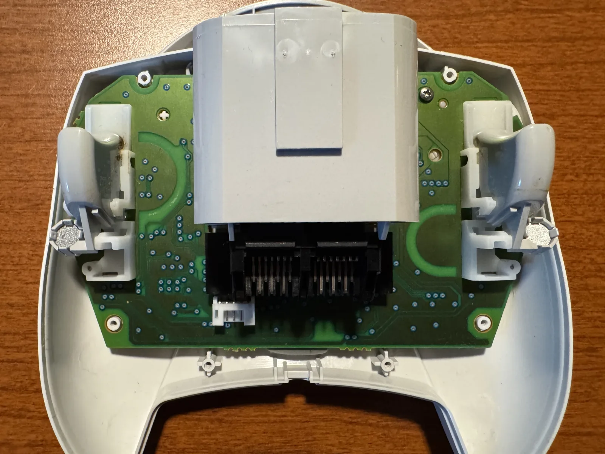
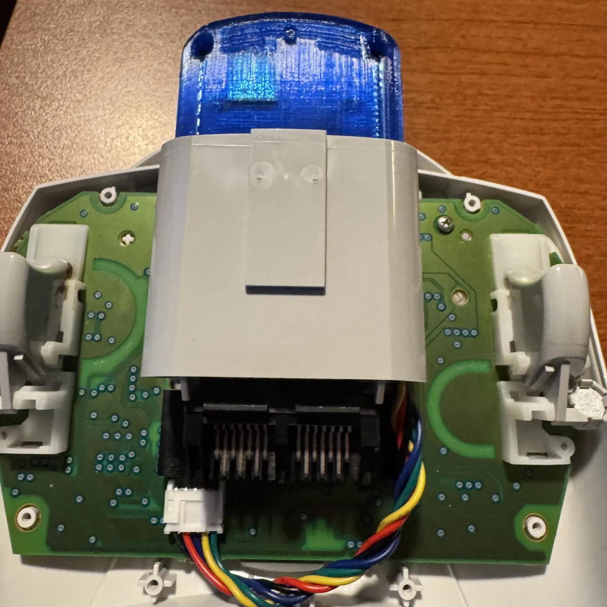
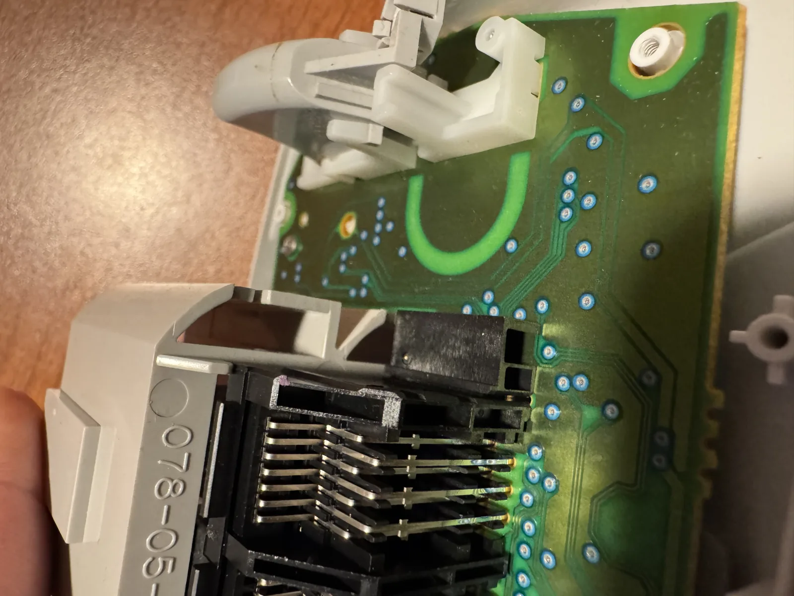
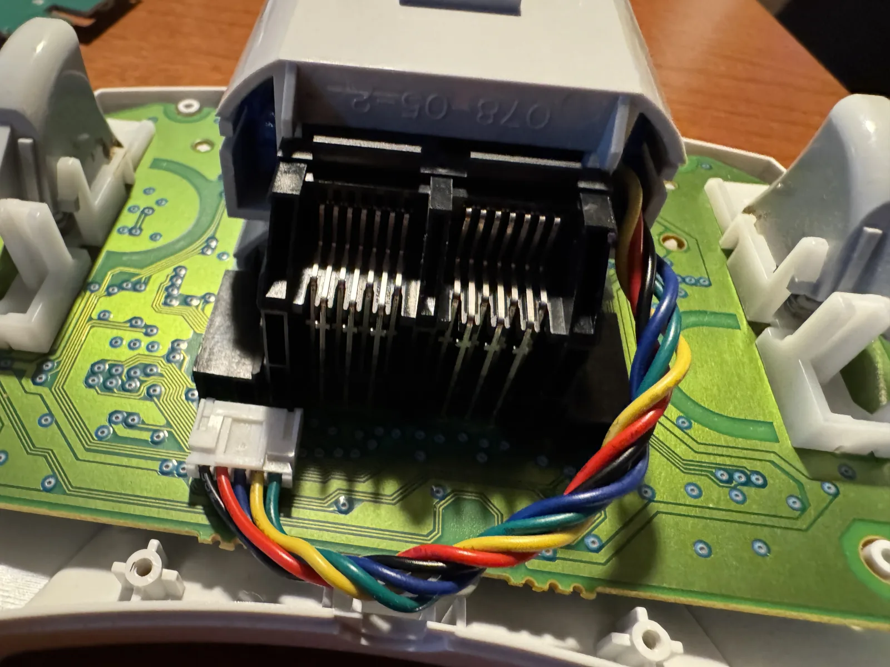
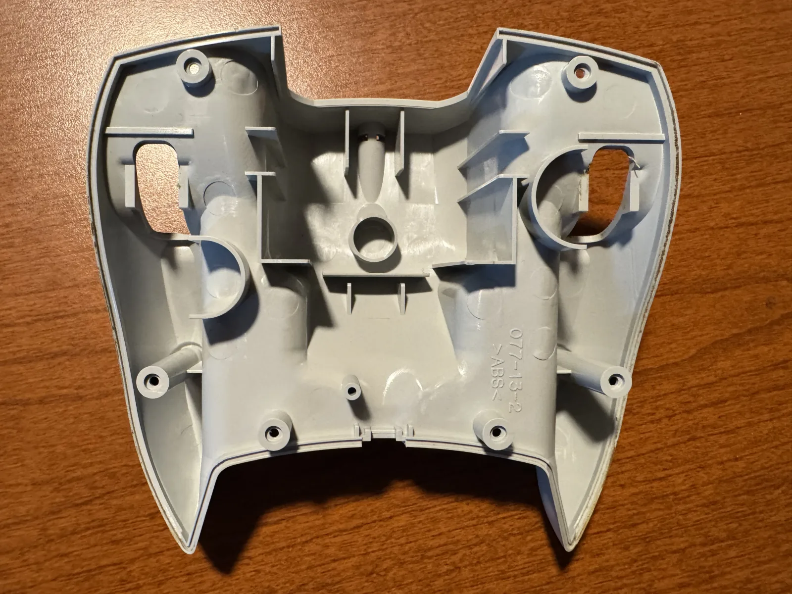
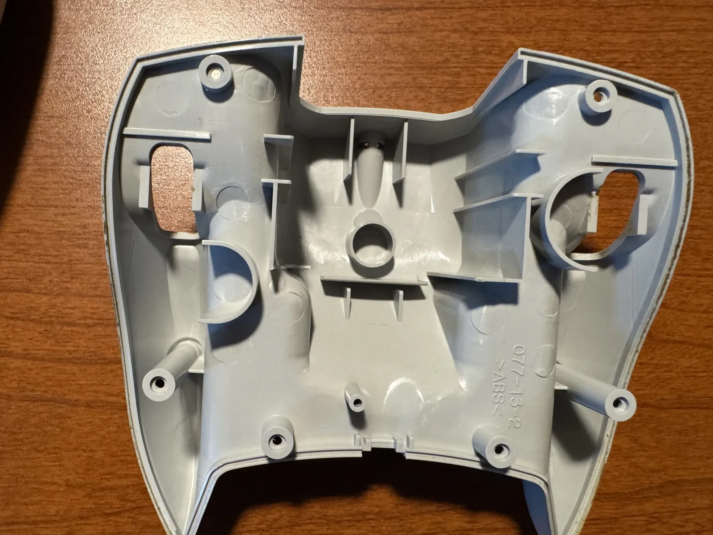
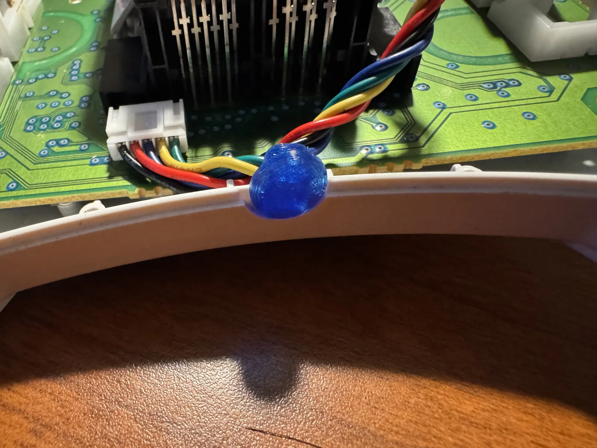

# Installing Pulsar v1 in a Dreamcast controller

> Markdown copy of <https://pulsar.alwaysagog.com/install> as of 2026-09-01.
> **The site is canonical** — if the two disagree, the site is right. This copy exists so
> the instructions travel with the repo and stay diffable against the page.

Pulsar replaces the original cable inside a first-party Dreamcast controller. Work through
the steps in order and **test the board before making the one permanent change** to the
back shell.

| | |
|---|---|
| Fasteners | 6 screws |
| Tool | Small Phillips |
| Modification | 1 cable guard |

This page is for an assembled **Pulsar v1**. Building the adapter yourself is a different
path — see [the XIAO build](xiao.md).

Start with the controller unplugged and face-down on a soft surface.

## Before you open it

**Set up a clear work area.**

- Disconnect the controller from the Dreamcast.
- Set aside the six screws where they cannot roll away.
- Have Pulsar and the included 3D-printed cable cover within reach.

## 01 · Open — remove the six back screws

Remove all six Phillips screws from the back of the controller. Lift the back shell
straight up and set it beside the controller. Keep the front half face-down so the buttons
stay in place.

Two screws sit near the cable; four sit around the grips.

## 02 · Disconnect — unplug the original cable

Find the white cable connector beside the accessory slots. Grip the cable close to the plug
and pull it as straight out of the socket as possible. Lift the original cable and its
strain relief out of the controller.

*The original cable before removal.*

## 03 · Fit — seat Pulsar in the second slot

Slide Pulsar into the second accessory slot. Route its cable through the right-hand opening
in the bottom of the controller, following the path in the photo, then press its white plug
into the controller connector until it is fully seated.

*Second slot, cable routed to the right-hand opening.*

*Use the second of the two accessory slots.*

*Match the plug orientation shown here.*

## Checkpoint — pair and test before changing the shell

Press Sync once to wake Pulsar. Then press and hold Sync for about 3 seconds, until the
status LED starts blinking rapidly. Open Bluetooth settings on the device you want to use,
find **Xbox Wireless Controller** and connect. Before closing the shell, verify the analog
stick and a few buttons in a game or controller test.

If Pulsar does not wake or appear, reseat the white connector now, while everything is
still open.

> Pulsar v1 only switches on the controller's 5 V supply once a Bluetooth host is
> connected, so an idle adapter charges instead of running the controller. Until you pair,
> the controller is unpowered and the VMU is blank — that is normal. See
> [the owner's manual](../pulsar_v1_manual.md) for the full behaviour.

## 04 · Permanent step — snap off the matching cable guard

On the inside of the back shell, locate the small plastic guard that lines up with the side
where Pulsar's cable exits. Press the guard sideways with your fingers; it should break away
cleanly at its thin joints.

> **This permanently changes the shell. Check the cable side twice before you snap
> anything.**

**Before** — the cable guard is still present.

**After** — the opening after a clean break.

## 05 · Protect — add the cable cover

Fit the 3D-printed cable cover into the opening around the Pulsar cable. Make sure it is
seated against the shell and that the cable lies naturally without a sharp bend.

*The cable cover protects the new exit from the shell edge.*

## 06 · Close — keep the cable clear of the standoff

Lower the back shell into place while watching the screw standoff nearest the cable. The
standoff must land **beside** the cable, never on top of it. The shell should sit flush
without force; if it does not, lift it and move the cable before trying again.

> **No pinching.** A trapped cable can be damaged when the screw is tightened. Do not force
> the shell shut.

## 07 · Finish — replace the six screws

Install all six screws and tighten them until snug. Do not overtighten into the old plastic.

Turn the controller over, wake Pulsar with Sync and enjoy your gaming.

## Next

- [Owner's manual](../pulsar_v1_manual.md) — buttons, LEDs, VMU, charging, sleep
- [User guide](../users_guide.md) — the same ground across all three boards
- [Updating the firmware](../pulsar_v1_manual.md#9-updating-the-firmware) — wireless, from your browser
