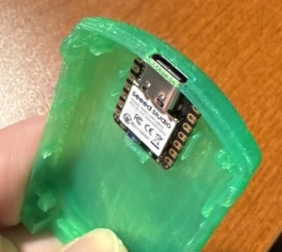
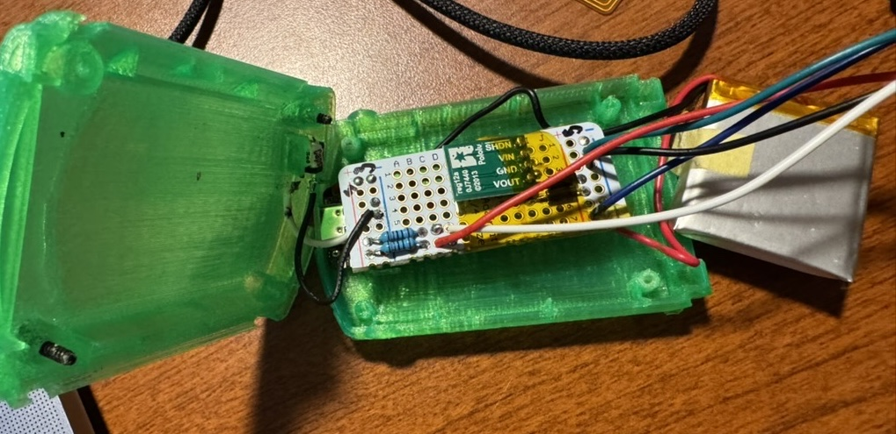
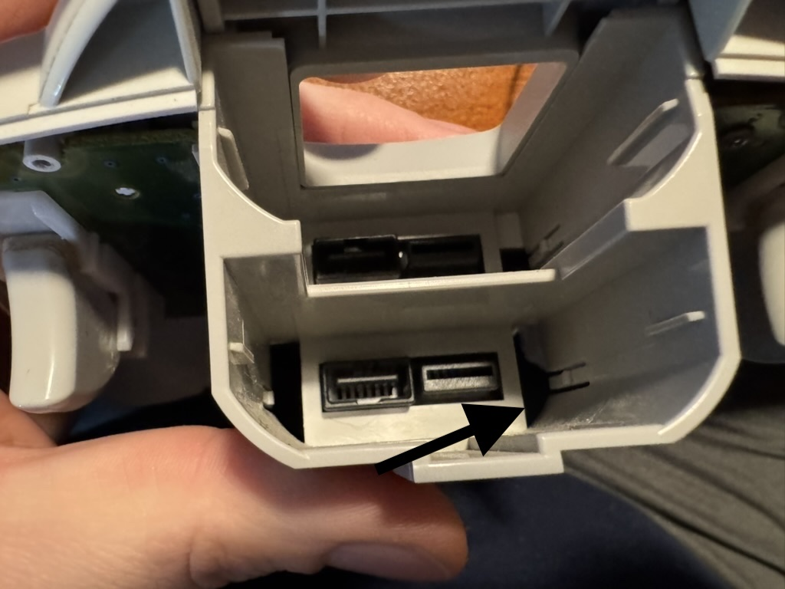
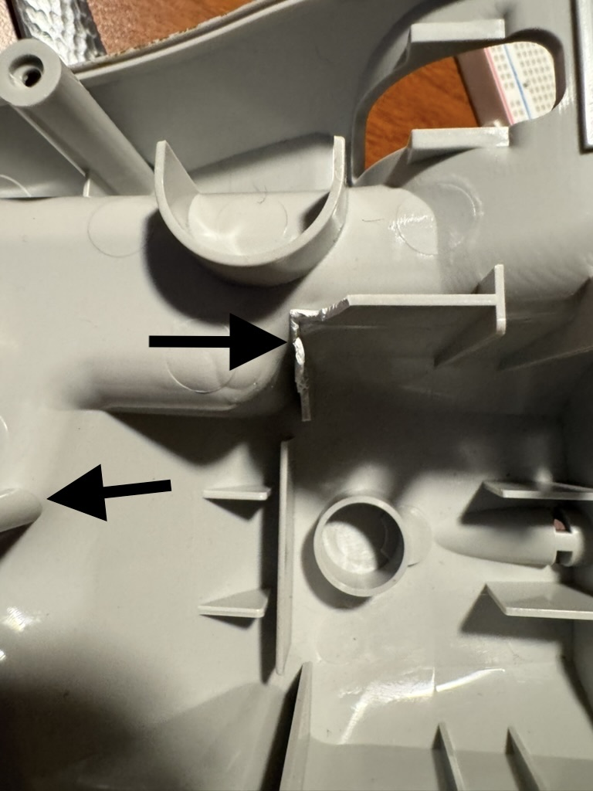

# Build it yourself — the XIAO adapter

The hand-wired build. A Seeed XIAO nRF52840, a boost converter, two resistors and two
diodes on a scrap of perfboard, wired into a cut Dreamcast controller cable. It plays
identically to a Pulsar v1; what it gives up is the LED bar, the fuel gauge, rumble, and
wireless updates.

**This permanently modifies a controller — the cable gets cut.** Budget an evening for a
first build, and use a controller you are willing to alter.

| | |
|---|---|
| Skills | Soldering, reading a multimeter |
| Permanent change | The controller cable is cut |
| Flashing | USB, drag-and-drop — no debug probe needed |
| Time | 2–3 hours for a first build |

Other paths: [nRF52840-DK on the bench](dk.md) (no soldering, no controller modification)
· [installing an assembled Pulsar v1](pulsar-v1.md).

---

## 1. What you need

Full details and links are in the [bill of materials](../bill_of_materials.md). The short
list:

| Part | Qty | Notes |
|---|---|---|
| Seeed XIAO nRF52840 | 1 | The plain version. **Not** the "Sense" — you do not need the IMU/mic, and it costs more |
| Dreamcast controller | 1 | First-party is the only one tested |
| Pololu U1V11F5 5 V boost | 1 | Chosen for its `SHDN` pin — the firmware gates the controller's 5 V rail with it |
| 1N5817 Schottky diode | 2 | The USB/boost OR — see [§3](#3-the-5-v-rail-and-why-it-catches-people) |
| 10 kΩ resistor | 2 | Bus pull-ups. 4.7 kΩ also works |
| LiPo battery, 1000 mAh | 1 | 3.7 V, JST PH 2.0 mm. ~14–16 h; a 500 mAh gives ~7–8 h |
| Perfboard | 1 | Adafruit Perma-Proto quarter-size fits the printed shell |
| Tactile pushbutton | 1 | The sync button |
| 30 AWG wire | — | |

**Tools:** soldering iron, wire strippers, **multimeter** (not optional — see
[§2](#2-identify-the-cable-conductors)), heat-shrink, Kapton tape.

The XIAO already contains the parts people expect to add: a **USB-C connector**, a
**BQ25101 LiPo charger** with its own status line, a **battery-voltage divider** on an ADC
pin, and an **RGB status LED**. You are not wiring any of those — they are on the module,
and the firmware drives them through pins that never leave the board.

---

## 2. Identify the cable conductors

Cut the controller cable a comfortable working distance from the controller — keep the
length you want between the controller and the adapter. **Keep the controller end**; the
console plug is not used.

The Maple pinout is:

| Pin | Typical colour | Function | Goes to |
|---|---|---|---|
| 1 | Red | SDCKA — data/clock A | XIAO **D5** (P0.05) |
| 2 | Blue | +5 V power | the 5 V rail ([§3](#3-the-5-v-rail-and-why-it-catches-people)) |
| 3 | Black | Ground — the cable shield ties here | GND |
| 4 | Green | Sense — tied to ground | GND |
| 5 | White | SDCKB — data/clock B | XIAO **D1** (P0.03) |

> ### Meter your actual cable. Do not trust the colours.
>
> Third-party and later-revision controllers use different colour codes, and the table
> above is the canonical *Maple pinout* — not a promise about the cable in your hand.
> Getting this wrong puts 5 V onto a data line and can destroy the controller, the XIAO, or
> both.

**How to check, with the cable cut and nothing powered:**

1. Look into the controller's own connector shell — the five contacts are numbered in the
   moulding, or count from the keyed edge.
2. Set the meter to continuity (the beeping mode).
3. Hold one probe on a stripped conductor at the cut end and touch the other to each of the
   five contacts in turn. The one that beeps is that conductor's pin.
4. Write the colour against the pin number as you go. Do all five before soldering anything.
5. Confirm pins 3 and 4 beep against *each other* — sense is tied to ground inside the
   controller. If they do not, stop: you have mis-identified something.

---

## 3. The 5 V rail, and why it catches people

The Dreamcast controller runs on **5 V**. The XIAO is a 3.3 V part and cannot supply it, so
the 5 V comes from one of two places, and the design lets either one feed the rail without
back-feeding the other:

- **USB**, when a cable is plugged in — straight off the XIAO's `5V` pin (VBUS).
- **The boost converter**, when running on battery — 3.7 V up to 5 V.

Wiring both to the same node directly would push USB voltage back into the boost's output
and battery voltage back into VBUS. The two Schottky diodes prevent that. This is a **diode
OR**: each source feeds the rail through its own diode, and neither can see the other.

```
   XIAO 5V pin ──────►│──┐         D1: 1N5817   (band = cathode, ──►│ points to the rail)
   (USB VBUS)         ▲  │
                         ├──── +5 V rail ──── controller cable pin 2 (blue)
   Boost VOUT ───────►│──┘         D2: 1N5817
                      ▲
   Battery + ──── Boost VIN
   Battery − ──── GND ─────────── controller cable pins 3 and 4 (black, green)

   XIAO D2 (P0.28) ─── Boost SHDN          HIGH = boost on
```

**Diode orientation is the one thing to get right.** The banded end (cathode) of both
diodes faces the **controller**, away from the sources. Backwards and the controller simply
never powers up.

Use **Schottky** diodes specifically. The 1N5817 drops ~0.3 V, leaving ~4.7 V at the
controller, which it is happy with. An ordinary 1N4001 drops ~0.7 V and can leave the
controller browning out under load.

### Why the boost has a shutdown pin

`SHDN` is wired to **D2 (P0.28)** and the firmware holds it **LOW at boot** — the boost is
off until a Bluetooth host actually connects. An adapter sitting idle on your desk charges
its battery instead of running a controller nobody is using.

The firmware also checks whether USB is present: if VBUS is there, the controller runs off
USB and the boost stays off entirely.

**Consequence to expect:** with no host connected, the controller is unpowered and a docked
VMU is blank. That is correct behaviour, not a fault. Pair first, and the controller comes
alive after.

---

## 4. Signal wiring

Two Maple data lines, each with a **10 kΩ pull-up to 3.3 V**:

```
   3.3 V ──┬── 10 kΩ ──┬── XIAO D5 (P0.05) ── cable pin 1, SDCKA (red)
           │           │
           └── 10 kΩ ──┴── XIAO D1 (P0.03) ── cable pin 5, SDCKB (white)
```

Take 3.3 V from the XIAO's `3V3` pin — **not** from the 5 V rail. The pull-ups define the
bus's idle-high level, and pulling them to 5 V puts 5 V into the nRF52840's GPIO.

The Maple bus runs at 2 Mbps and the firmware bit-bangs it against a cycle counter. **Keep
these two wires short and roughly equal in length**, and keep them away from the boost
converter's inductor, which is the noisiest thing on the board. A long, draped, or
inductor-adjacent pair is the usual cause of a controller that enumerates intermittently.

### Sync button

```
   XIAO D10 (P1.15) ──── pushbutton ──── GND
```

Active low, with the nRF's internal pull-up enabled in firmware — **no external resistor**.

### Everything else is on the module

| Function | Pin | |
|---|---|---|
| RGB status LED | P0.26 / P0.30 / P0.06 | onboard, active low |
| Battery ADC | P0.31, gated by P0.14 | onboard divider |
| Charger status | P0.17 | onboard BQ25101 |
| Charge current select | P0.13 | onboard |

Leave all of these alone. The complete assignment for all three boards is in
[pin mapping](../pin_mapping.md).

---

## 5. Check before you power it

Two minutes here saves a dead controller. With **nothing plugged in and no battery
connected**:

1. **Continuity**, end to end, on all five conductors from the cut end to the controller's
   connector.
2. **Shorts between conductors** — probe every adjacent pair. Nothing should beep except
   pins 3 and 4 (ground and sense).
3. **The rail against ground** — no continuity between the +5 V rail and GND. A short here
   is the one that destroys parts.
4. **Diode direction** — in diode-test mode, each diode should conduct from its source
   toward the rail and block the other way.

Then connect the battery *only* and check with the meter:

5. **~3.7 V** across the battery terminals at the board.
6. **~0 V on the 5 V rail** — the boost is held off at boot, so this is what "working"
   looks like before flashing. If you read 5 V here with no firmware loaded, `SHDN` is
   floating or tied high; fix that before plugging in the controller.

---

## 6. Flash it

The XIAO ships with a UF2 bootloader that includes the Nordic SoftDevice, so no debug
probe is needed.

1. Download `pulsar-dreamcast-ble-xiao.uf2` from the
   [Releases page](https://github.com/alwaysEpic/pulsar-dreamcast-ble/releases).
2. Plug the XIAO into USB.
3. **Double-tap the reset button** — quickly, about like a mouse double-click. A drive
   named **`XIAO-BOOT`** appears.
4. Copy the `.uf2` onto it:

   ```bash
   cp pulsar-dreamcast-ble-xiao.uf2 /Volumes/XIAO-BOOT/
   ```

5. The drive disconnects on its own and the board reboots into the firmware. That is the
   whole update path, for this and every future release.

Building from source instead, or flashing over SWD for RTT debug logging, is in
[flash commands](../flash-commands.md). **Release builds are mandatory** — a debug build
misses the Maple timing window and will not talk to the controller.

### First boot — what should happen

| You see | Meaning |
|---|---|
| Green blinks a few times | Firmware started |
| **Solid red** | Searching for the controller |
| **Solid green** | Controller detected and talking |
| Nothing at all | Not running — re-check the flash, then power |

Remember the ordering: on battery with no host connected, the boost is off, so the
controller is unpowered and the light stays red. **Pair first.**

1. On your host, scan for **"Xbox Wireless Controller"** and connect.
2. The boost switches on, the controller powers up, a docked VMU chirps, and the light goes
   green.
3. Test the stick and a few buttons in a gamepad tester before closing anything up.

If it never pairs, hold sync for 2 seconds to clear the bond and re-enter pairing mode.

---

## 7. Enclosure

A 3D-printable VMU-shaped shell is in [`3d_files/`](../../3d_files/) — see
[`3d_files/README.md`](../../3d_files/README.md) for which family fits this build and for
print settings.

The controller shell needs a small trim for cable clearance, and the cable routes through
the VMU slot opening:

<table>
  <tr>
    <td></td>
    <td></td>
  </tr>
  <tr>
    <td></td>
    <td></td>
  </tr>
</table>

Check that the USB-C port and the sync button are both reachable once assembled — they are
your only update path and your only control.

---

## 8. Now use it

- [User guide](../users_guide.md) — buttons, profiles, VMU screens, sleep, LEDs,
  troubleshooting, and which parts are board-specific
- [Remapping from your browser](../users_guide.md#remapping-buttons-from-your-browser) —
  works on this build too
- [Input quality testing](../input_quality_testing.md) — if you want to measure latency and
  packet loss

## Troubleshooting a fresh build

| Symptom | Look at |
|---|---|
| Light stays red forever | Controller has no 5 V. Check the diode direction, then that the boost's `SHDN` reaches D2, then that you are actually connected to a host |
| Never appears in Bluetooth | Firmware not running. Re-flash; confirm you used a **release** `.uf2` |
| Connects, but inputs are erratic or drop | Bus wiring. Shorten SDCKA/SDCKB, keep them clear of the boost inductor, confirm both pull-ups go to **3.3 V** |
| Works on USB, dead on battery | The boost — `SHDN` wiring, or its VIN not on the battery |
| Works on battery, dead on USB | The USB-side diode: backwards, or a non-Schottky part dropping too much |
| VMU blank | Expected until a host connects. If it stays blank after pairing, re-seat it |

More, including host-side issues, in the
[user guide's troubleshooting section](../users_guide.md#troubleshooting).
