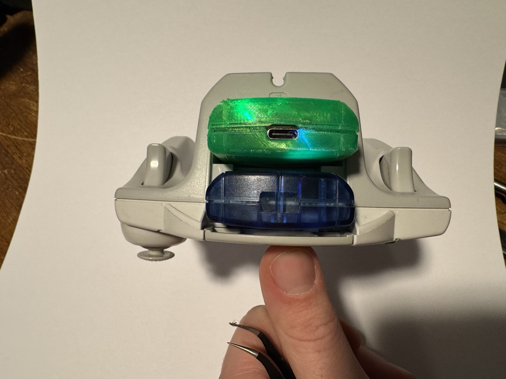
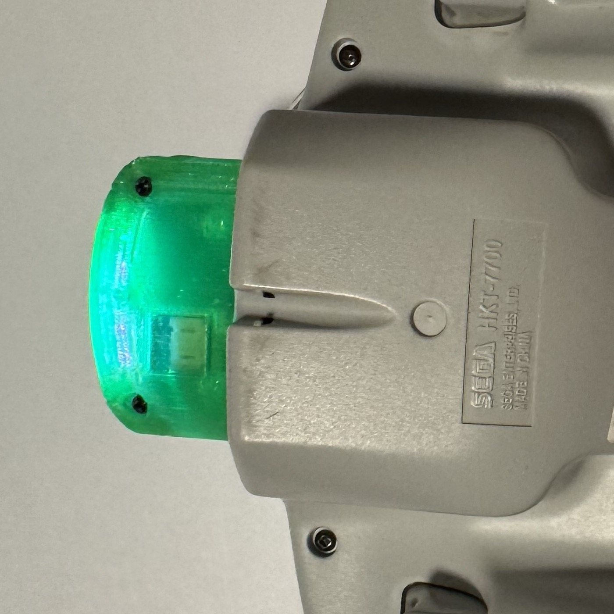

# Dreamcast Wireless Controller Adapter - User Guide

## What You Need

- Controller wired with Pulsar device
- A Bluetooth Low Energy capable device (phone, tablet, PC, or Dreamcast with BLE receiver like iBlueControlMod)

## Which board do you have?

The same firmware runs on three boards. They behave identically as a gamepad — everything in
Button Mapping, Profiles, and the VMU Display applies to all of them — but they differ in
what they can *show* you and how you update them. Where a section below is board-specific,
it says so.

| | **Pulsar v1** | **XIAO** (DIY) | **DK** (bench) |
|---|---|---|---|
| What it is | The designed carrier board, with a XIAO nRF52840 module mounted on it | A XIAO nRF52840 wired up by hand on perfboard or a breadboard | Nordic nRF52840-DK dev kit |
| Status light | 5-LED bar: LED 0 status, LEDs 1–4 battery | The XIAO's onboard RGB (one LED) | Discrete kit LEDs |
| Battery gauge | IP5306 fuel gauge, four levels | Voltage estimate from the battery ADC | None — no battery |
| Rumble | Yes, ERM motor | No | No |
| Charging | Onboard, USB-C | Onboard, via the XIAO's USB-C | Not applicable |
| Firmware update | Wireless (OTA) | USB drag-and-drop (UF2) | Debug probe |
| Sleep | Deep sleep (System Off) | Deep sleep (System Off) | Halts instead of sleeping |

Pulsar v1 and the DIY build share the same XIAO module, so they run the same silicon — the
carrier adds power management, the LED bar, and the rumble motor around it.

## First-Time Pairing

1. **Power on** the adapter. The status light blinks briefly, then shows *searching* while it
   looks for the controller — red on Pulsar v1 and XIAO, LED4 on the DK.
2. Once the controller is detected, the status light turns green (LED3 on the DK).
3. The adapter automatically enters **pairing mode** on first boot (since no device is bonded yet). It will be discoverable for 60 seconds.
4. On your host device, open Bluetooth settings and look for **"Xbox Wireless Controller"**.
5. Select it to pair. The LED will turn solid to indicate a connection.

That's it! The adapter remembers your device and will reconnect automatically in the future.

## Reconnecting

After the first pairing, the adapter reconnects automatically:

1. Power on the adapter.
2. Turn on Bluetooth on your host device.
3. The adapter will find and connect to your previously paired device within a few seconds.

No need to re-pair each time.

## Button Mapping

| Dreamcast | Xbox Equivalent |
|-----------|----------------|
| A | A |
| B | B |
| X | X |
| Y | Y |
| Start | Menu |
| D-pad Up | D-pad Up |
| D-pad Down | D-pad Down |
| D-pad Left | D-pad Left |
| D-pad Right | D-pad Right |
| Left Trigger | Left Trigger |
| Right Trigger | Right Trigger |
| Analog Stick | Left Stick |

The Dreamcast controller has one analog stick, which maps to the left stick. The right stick is not available.

### Guide / Xbox Button (chord)

The Dreamcast pad has no Guide button, so it's a chord: **pull Left Trigger + Right Trigger and hold Start together (about a third of a second).** This sends the **Guide (Xbox) button** — e.g. it opens the **Steam overlay** / Big Picture, or the Xbox Game Bar.

- It's deliberately a *hold* so it won't fire by accident during play, and it's kept off the face buttons so it never collides with the Dreamcast/GDEMU `A+B+X+Y+Start` reset combo. While held, the triggers and Start are suppressed so the host sees only Guide.
- The chord works on **both profiles.** On **Xbox** it's the real native Guide button (the Steam overlay opens automatically). On **Dreamcast** it comes through as a plain **Button 11** — bind that to "Guide" in Steam Input (or your host's controller settings) if you want the overlay shortcut there.

## Sync Button

| Action | Result |
|---|---|
| Short press | Wake / request reconnect |
| Hold 2s | Pairing mode (60s) — clears the current bond |
| Hold 3.5s **+ controller Start** | Firmware update mode (OTA) — *Pulsar v1 only* |
| Hold 7s | Sleep — shows `BYE`, releases into deep sleep (the DK halts instead) |
| Triple-press | Switch profile (Xbox ⇄ Dreamcast) and reboot |

The sync LED blinks faster once you pass 2s, so you can see the next step coming before you reach it. Release at that point to pair; keep holding to sleep.

**Firmware update** needs both hands: hold the sync button past 3.5s *while* the Dreamcast controller's **Start** button is held. Three fast flashes confirm it. Requiring the controller means it cannot fire from pairing mode or with nothing plugged in. It is refused on a low battery unless you are charging — the display shows `CHRG` if so. Holding past 3.5s with Start down does **not** clear your pairing.

This gesture is for **Pulsar v1**, which updates wirelessly. On a XIAO or DK build the gesture does nothing useful — those boards are reflashed over USB or a probe instead. See [Updating the firmware](#updating-the-firmware).

After holding 2s and pairing fresh, the **old** host still has us in its Bluetooth list. Forget the adapter there before it'll let you pair again — same as any single-bond controller (Xbox, etc.).

### Profiles

Two identities, switchable with a triple-press. **Use Xbox by default** — it now works essentially everywhere tested: macOS (browser + Steam), Windows (+ Steam), Linux (xpadneo), BlueRetro, and BLE receivers.

The **Dreamcast** profile is **not** a Dreamcast-controller emulation — it's just a plain, **generic BLE HID gamepad**; the only "Dreamcast" thing about it is the Bluetooth name. Pick it if you'd rather not present as an Xbox controller (e.g. to avoid Xbox button prompts in games) or for a host that prefers a neutral HID gamepad.

| Profile | Best for | Bluetooth name |
|---|---|---|
| **Xbox** (default) | macOS (browser + Steam), Windows (+ Steam), Linux (xpadneo), BlueRetro, iBlueControlMod / BLE receivers — anything that recognizes an Xbox controller | Xbox Wireless Controller |
| **Dreamcast** | A plain, generic BLE HID gamepad (neutral identity — only the Bluetooth name is Dreamcast-branded) — Android, simple HID consumers, or hosts where you'd rather not present as Xbox | Dreamcast Wireless Controller |

After switching, forget the adapter on your host and pair again so it picks up the new HID layout. The profile is saved to flash.

## VMU Display

The adapter draws on the VMU LCD while connected — a profile splash on every connect, then a rotating pulsar with battery indicator. Mode transitions get their own splash.

<table>
  <tr>
    <td align="center"> Xbox profile (boot)</td>
    <td align="center"> Dreamcast profile (boot)</td>
    <td align="center"> In-session</td>
  </tr>
  <tr>
    <td align="center"> Pairing mode</td>
    <td align="center"> Sleeping</td>
    <td></td>
  </tr>
</table>

The profile splash holds for ~30 seconds after connect, then transitions to the rotating pulsar with battery indicator.

> **Battery note:** the VMU updates ~6 times per second to animate the pulsar, plus extra writes on splash transitions. This costs roughly 5–10% of battery life vs. running with no LCD activity. Worth it for the visual feedback, but worth knowing.

## Battery & Charging

The adapter monitors the LiPo battery and reports the level over Bluetooth (visible in your host device's Bluetooth settings or supported games), and draws it on the VMU.

- **Full charge:** 4.2V
- **Empty:** 3.0V

How the level is measured depends on the board:

| Board | How it reads | What you see |
|---|---|---|
| **Pulsar v1** | IP5306 fuel gauge over I²C | Four levels (25 / 50 / 75 / 100%). LEDs 1–4 of the bar light in magenta, one per level — a deliberately different colour from the status LED so the two meanings can't be confused. |
| **XIAO** | Battery ADC against a LiPo discharge curve | A continuous percentage. The single onboard RGB has no room for a gauge, so it shows status only — read the level on the VMU or your host. |
| **DK** | No battery, no gauge | Nothing. The board reports no battery at all rather than a fake reading. |

Because the Pulsar v1 gauge moves in 25% steps, its indicator jumps between four states
rather than sliding down gradually. That's the gauge, not a fault.

*The USB-C port faces out through the slot opening on the controller's underside — the
adapter charges in place, and a VMU in the second slot is unaffected.*

Charge the battery over USB-C — on Pulsar v1 that's the carrier's own port, on a DIY build it's the XIAO's. A USB power brick or phone charger is recommended. **Note:** Some laptops (especially MacBooks) have smart USB ports that may reduce or cut power when the adapter is in deep sleep, since the USB peripheral is off and the laptop doesn't detect a device. If you notice the battery not charging from a laptop, either use a standard USB charger or keep the adapter awake while plugged in.

## Rumble

**Pulsar v1 only.** The carrier drives an ERM motor, so games and hosts that send rumble
commands over Bluetooth will make it buzz. Intensity follows what the host asks for.

The XIAO and DK builds have no motor — rumble commands arrive and are ignored, which is
harmless. It does mean the Xbox profile advertises rumble support on every board, because the
report is part of the profile the host expects, not a per-board capability.

## Sleep & Wake

The adapter enters deep sleep to save battery in these situations:

1. **Manual sleep** -- hold the sync button for 7 seconds.
2. **No Bluetooth connection** for 60 seconds after power-on (advertising timeout).
3. **Controller not found** for 60 seconds after Bluetooth connects (detection timeout).
4. **Controller disconnected** for 60 seconds while BLE is connected (re-detect timeout).
5. **No controller input** for 10 minutes while connected (inactivity timeout).

When asleep, the adapter draws minimal power (~5 microamps). The battery charges normally from USB while asleep.

**To wake up:** Press the sync button. The adapter performs a full restart and will reconnect to your paired device.

The **DK** has no battery and no power management, so it halts on the sleep gesture instead of entering deep sleep — the goodbye splash still runs, which is what makes the flow testable on the bench.

## Updating the firmware

> **Updating from v0.3.0 or earlier: you will need to pair again.**
>
> This release moves where the adapter stores its Bluetooth pairing, so the old bond is not
> carried across. After updating, the adapter will not reconnect to your host on its own.
> Forget the adapter in your host's Bluetooth settings, hold sync for 2 seconds, and pair
> fresh. This is a one-time step — future updates keep your pairing.

How you update depends on the board:

**Pulsar v1 — wireless.** Hold sync past 3.5s with the controller's **Start** held; three fast
flashes confirm it and the adapter reboots into update mode advertising as `PulsarDFU`. It is
refused on a low battery unless you're charging, showing `CHRG` on the VMU — charge first and
retry. The update is signed, so the adapter only accepts official firmware.

> **There is no reset-button route into update mode on Pulsar v1, and no USB drive.**
> Double-tapping reset does nothing, holding a button while powering on does nothing, and no
> `XIAO-BOOT` volume will appear. Both button entry and pin-reset entry are deliberately
> switched off in this board's bootloader — the sync + Start gesture is the only way in.
>
> Two consequences worth knowing before you need them:
>
> - **The gesture needs the controller attached**, because it checks that Start is held. With
>   no controller plugged in there is no way to enter update mode by hand.
> - **A failed or interrupted update is not a brick.** If the firmware is missing or
>   incomplete, the adapter enters update mode on its own at power-on and waits to be
>   re-flashed. Plug it in, reload the update page, and try again.

#### Your browser has to support Web Bluetooth

The update page talks to the adapter over Bluetooth from the browser, and not every browser
allows that. If the page never shows a device chooser, this is almost always why.

| Browser | Works? |
|---|---|
| **Chrome / Edge / Opera** on Windows or macOS | Yes, out of the box |
| **Brave** | Yes, **but you must turn it on first** — see below |
| **Chrome on Linux** | Needs `chrome://flags/#enable-experimental-web-platform-features` enabled, plus BlueZ 5.41 or newer |
| **Firefox** | No — not supported on any platform |
| **Safari**, including iPhone and iPad | No — not supported, and not planned |

**Brave** ships with Web Bluetooth switched off deliberately, as a privacy choice. To enable
it: open `brave://flags`, search for **Web Bluetooth API**, set it to **Enabled**, and relaunch
the browser. Without that step the page loads normally and simply never finds your adapter,
with no error to explain why — which is exactly what makes it worth checking first.

**On an iPhone or iPad there is no way to make Safari work**, because Apple does not implement
the API. Update from a computer, or use a third-party Web Bluetooth browser such as Bluefy.

**XIAO — USB drag-and-drop.** Double-tap the reset button; the board mounts as a USB drive
called `XIAO-BOOT`. Copy the `.uf2` file onto it and it reboots into the new firmware.

> **The web updater will not find a XIAO build — use the USB route.** This is not a fault in
> your browser or your board. A DIY XIAO runs the stock Adafruit bootloader, which speaks an
> older update protocol whose Bluetooth service Chrome blocks permanently, by name, as a
> matter of policy. No browser will ever reach it. Pulsar v1 carries a different bootloader
> specifically so the web route works there.

**DK — debug probe.** Flash over the onboard debugger with your usual tool.

Release builds are required on every board. Debug builds miss the Maple Bus timing window and
the controller will not be read reliably.

## LED Indicators

Every board shows the same *states*; what lights up differs.

**Pulsar v1 — five-LED bar.** LED 0 carries status; LEDs 1–4 are the battery gauge and stay
lit through status changes, so losing the controller doesn't blank your battery reading. The
colours are deliberately dim to avoid glare through the shell window.

| LED 0 | Meaning |
|---|---|
| Dim red | Searching for controller |
| Dim green | Controller found / connected |
| All dark | Sleeping or idle |

*The status LED lighting the shell from the VMU slot (green = connected). The magenta
gauge LEDs sit behind the same window.*

**XIAO — onboard RGB (one LED).** No battery gauge; the level is on the VMU and your host.

**DK — discrete kit LEDs.** LED4 searching, LED3 connected, LED2 flickers on Maple TX
activity. LED1 is the sync LED.

| State | XIAO (RGB) | DK | Meaning |
|---|---|---|---|
| Starting up | Green blink ×3 | — | Boot |
| Searching | Solid red | LED4 on | Looking for the controller |
| Connected | Solid green | LED3 on | Controller found |
| Pairing mode | Fast blue blink | Sync LED blinking | Discoverable for 60s |
| Sync held | Blink | Sync LED blink | Button held, action pending |
| Past sync point | Faster blink | Faster blink | Approaching sleep |
| Profile switched | 5 quick flashes | 5 quick flashes | Confirmed, about to reboot |
| Off | Off | Off | Sleeping or idle |

The sync LED behaviour (blink while held, faster past the 2s point, five flashes on profile
switch) is the same on all three boards — on Pulsar v1 and XIAO it's the blue channel of the
status light, on the DK it's LED1.

## Troubleshooting

**Controller not detected (status stays on *searching* — red, or LED4 on the DK)**
- Check that the controller cable is securely connected to the adapter.
- Make sure the controller is receiving 5V power.
- Try unplugging and re-plugging the controller.

**Double-tapping reset does nothing / no USB drive appears (Pulsar v1)**
- Expected. This board has no reset-button route into update mode and no `XIAO-BOOT` volume — button and pin-reset entry are both disabled in its bootloader. Use the sync + Start gesture instead. See [Updating the firmware](#updating-the-firmware).

**The update page never shows a device chooser (Pulsar v1)**
- Check the browser first. **Brave** has Web Bluetooth off by default — enable **Web Bluetooth API** in `brave://flags` and relaunch. **Firefox and Safari** don't support it at all, including on iPhone and iPad. **Chrome on Linux** needs `chrome://flags/#enable-experimental-web-platform-features`. Chrome, Edge, and Opera on Windows or macOS work as-is. See [Updating the firmware](#updating-the-firmware).
- If the browser is fine, make sure the adapter is actually in update mode — it advertises as `PulsarDFU`, not under its usual name.

**The web updater never finds my adapter (XIAO build)**
- Expected, and not fixable from your side. A DIY XIAO runs the Adafruit bootloader, whose update service Chrome blocks by policy. Update it over USB with the `.uf2` file instead.

**I can't get into update mode — no controller attached (Pulsar v1)**
- The gesture checks that the controller's Start is held, so it needs a controller plugged in. Attach one and retry. If the firmware itself is broken or missing, the adapter enters update mode on its own at power-on without any gesture.

**It won't reconnect after a firmware update**
- Expected when coming from v0.3.0 or earlier — the pairing does not survive that update. Forget the adapter on your host, hold sync for 2 seconds, and pair fresh. See [Updating the firmware](#updating-the-firmware).

**Battery indicator jumps in big steps (Pulsar v1)**
- Normal. The IP5306 gauge reports four levels, so the bar moves 100 → 75 → 50 → 25 rather than sliding down continuously.

**Rumble does nothing**
- Only Pulsar v1 has a motor. XIAO and DK builds accept rumble commands and ignore them.

**Can't find "Xbox Wireless Controller" in Bluetooth**
- The adapter may not be in pairing mode. Hold the sync button for 2 seconds to enter pairing mode.
- Make sure you're within Bluetooth range (about 10 meters / 30 feet).
- On some devices, you may need to "forget" the old pairing first, then hold sync for 2 seconds to re-pair.

**Previously paired device can't reconnect after syncing to a new device**
- Go to Bluetooth settings on the old device and select "Forget This Device" for the adapter.
- Then hold the sync button for 2 seconds on the adapter to enter pairing mode and pair fresh.

**Connected but no input**
- Some hosts need a moment after connecting to discover services. Wait a few seconds after the connection is established.
- Try pressing buttons on the Dreamcast controller to verify it's responding.

**Adapter keeps going to sleep**
- Press the sync button to wake it up.
- The adapter sleeps after 60 seconds without a Bluetooth connection, 60 seconds if Bluetooth connects but no controller is detected, or after 10 minutes of no controller input. Keep interacting with the controller to prevent the inactivity timeout.

**Inputs feel wrong or mapped incorrectly**
- Try the other profile: triple-press sync to switch between Xbox and Dreamcast. After switching, forget the adapter on your host and pair fresh — most hosts cache the HID layout per-bond.
- Some hosts remap buttons in their own settings (Steam Input, accessibility shortcuts). Check there too.

**Flycast's mapping screen shows the stick "Up"/"Left" rows blank**
- Use the **Xbox** profile for SDL-based emulators (Flycast, RetroArch); the Dreamcast stick maps to the left analog stick.
- After "Reset to default," Flycast may label only the **Down**/**Right** rows ("Left Stick Y+/X+") and leave **Up**/**Left** blank. That's cosmetic — it binds the *full* axis to both directions, so the stick works fully in-game. No need to reset again or hand-map the blank rows.
