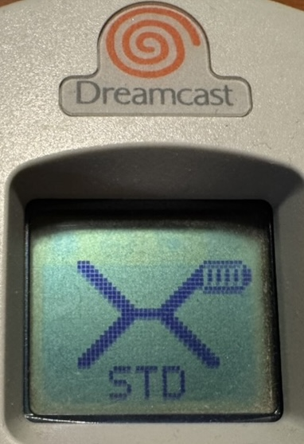
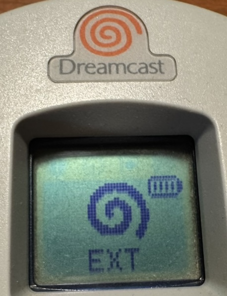
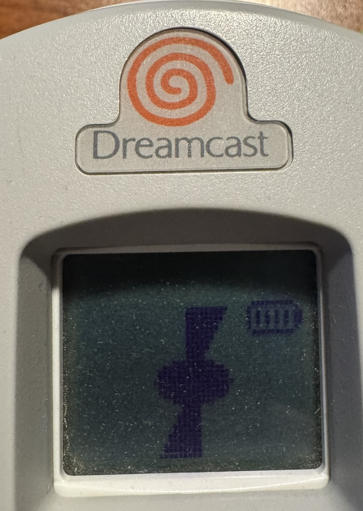
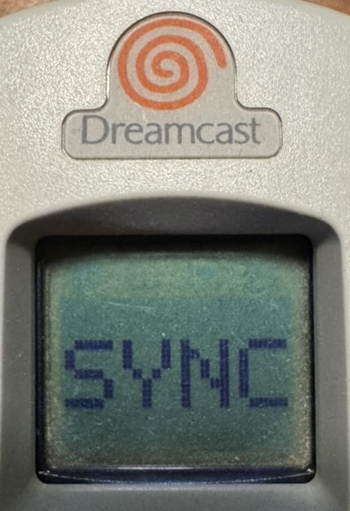
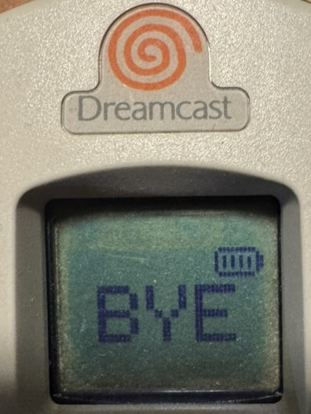

# Dreamcast Wireless Controller Adapter - User Guide

## What You Need

- Controller wired with Pulsar device
- A Bluetooth Low Energy capable device (phone, tablet, PC, or Dreamcast with BLE receiver like iBlueControlMod)

## First-Time Pairing

1. **Power on** the adapter. The LED will blink briefly, then blink rapidly while it searches for the controller.
2. Once the controller is detected, the LED turns a solid color.
3. The adapter automatically enters **pairing mode** on first boot (since no device is bonded yet). It will be discoverable for 60 seconds.
4. On your host device, open Bluetooth settings and look for **"Xbox Wireless Controller"**.
5. Select it to pair. The LED will turn solid to indicate a connection.

That's it! The adapter remembers your device and will reconnect automatically in the future.

## Reconnecting

After the first pairing, the adapter reconnects automatically:

1. Power on the adapter.
2. Turn on Bluetooth on your host device.
3. The adapter will find and connect to your previously paired device within a few seconds.

No need to re-pair each time.

## Button Mapping

| Dreamcast | Xbox Equivalent |
|-----------|----------------|
| A | A |
| B | B |
| X | X |
| Y | Y |
| Start | Menu |
| D-pad Up | D-pad Up |
| D-pad Down | D-pad Down |
| D-pad Left | D-pad Left |
| D-pad Right | D-pad Right |
| Left Trigger | Left Trigger |
| Right Trigger | Right Trigger |
| Analog Stick | Left Stick |

The Dreamcast controller has one analog stick, which maps to the left stick. The right stick is not available.

### Guide / Xbox Button (chord)

The Dreamcast pad has no Guide button, so it's a chord: **pull Left Trigger + Right Trigger and hold Start together (about a third of a second).** This sends the **Guide (Xbox) button** — e.g. it opens the **Steam overlay** / Big Picture, or the Xbox Game Bar.

- It's deliberately a *hold* so it won't fire by accident during play, and it's kept off the face buttons so it never collides with the Dreamcast/GDEMU `A+B+X+Y+Start` reset combo. While held, the triggers and Start are suppressed so the host sees only Guide.
- The chord works on **both profiles.** On **Xbox** it's the real native Guide button (the Steam overlay opens automatically). On **Dreamcast** it comes through as a plain **Button 11** — bind that to "Guide" in Steam Input (or your host's controller settings) if you want the overlay shortcut there.

## Sync Button

| Action | Result |
|---|---|
| Short press | Wake / request reconnect |
| Hold 3s | Pairing mode (60s) — clears the current bond |
| Hold 10s | Sleep — shows `BYE`, releases into deep sleep |
| Triple-press | Switch profile (Xbox ⇄ Dreamcast) and reboot |

After holding 3s and pairing fresh, the **old** host still has us in its Bluetooth list. Forget the adapter there before it'll let you pair again — same as any single-bond controller (Xbox, etc.).

### Profiles

Two identities, switchable with a triple-press. **Use Xbox by default** — it now works essentially everywhere tested: macOS (browser + Steam), Windows (+ Steam), Linux (xpadneo), BlueRetro, and BLE receivers.

The **Dreamcast** profile is **not** a Dreamcast-controller emulation — it's just a plain, **generic BLE HID gamepad**; the only "Dreamcast" thing about it is the Bluetooth name. Pick it if you'd rather not present as an Xbox controller (e.g. to avoid Xbox button prompts in games) or for a host that prefers a neutral HID gamepad.

| Profile | Best for | Bluetooth name |
|---|---|---|
| **Xbox** (default) | macOS (browser + Steam), Windows (+ Steam), Linux (xpadneo), BlueRetro, iBlueControlMod / BLE receivers — anything that recognizes an Xbox controller | Xbox Wireless Controller |
| **Dreamcast** | A plain, generic BLE HID gamepad (neutral identity — only the Bluetooth name is Dreamcast-branded) — Android, simple HID consumers, or hosts where you'd rather not present as Xbox | Dreamcast Wireless Controller |

After switching, forget the adapter on your host and pair again so it picks up the new HID layout. The profile is saved to flash.

## VMU Display

The adapter draws on the VMU LCD while connected — a profile splash on every connect, then a rotating pulsar with battery indicator. Mode transitions get their own splash.

<table>
  <tr>
    <td align="center"> Xbox profile (boot)</td>
    <td align="center"> Dreamcast profile (boot)</td>
    <td align="center"> In-session</td>
  </tr>
  <tr>
    <td align="center"> Pairing mode</td>
    <td align="center"> Sleeping</td>
    <td></td>
  </tr>
</table>

The profile splash holds for ~30 seconds after connect, then transitions to the rotating pulsar with battery indicator.

> **Battery note:** the VMU updates ~6 times per second to animate the pulsar, plus extra writes on splash transitions. This costs roughly 5–10% of battery life vs. running with no LCD activity. Worth it for the visual feedback, but worth knowing.

## Battery & Charging

The adapter monitors the LiPo battery and reports the level over Bluetooth (visible in your host device's Bluetooth settings or supported games).

- **Full charge:** 4.2V
- **Empty:** 3.0V

Charge the battery by connecting USB to the XIAO board. A USB power brick or phone charger is recommended for charging. **Note:** Some laptops (especially MacBooks) have smart USB ports that may reduce or cut power when the adapter is in deep sleep, since the USB peripheral is off and the laptop doesn't detect a device. If you notice the battery not charging from a laptop, either use a standard USB charger or keep the adapter awake while plugged in.

## Sleep & Wake

The adapter enters deep sleep to save battery in these situations:

1. **Manual sleep** -- hold the sync button for 10 seconds.
2. **No Bluetooth connection** for 60 seconds after power-on (advertising timeout).
3. **Controller not found** for 60 seconds after Bluetooth connects (detection timeout).
4. **Controller disconnected** for 60 seconds while BLE is connected (re-detect timeout).
5. **No controller input** for 10 minutes while connected (inactivity timeout).

When asleep, the adapter draws minimal power (~5 microamps). The battery charges normally from USB while asleep.

**To wake up:** Press the sync button. The adapter performs a full restart and will reconnect to your paired device.

## LED Indicators

| LED State | Meaning |
|-----------|---------|
| Green blink (3x) | Starting up |
| Solid red | Searching for controller |
| Solid green | Controller found / connected |
| Fast blink (blue) | Pairing mode active (60s) |
| Blink while holding | Sync button held, pending action |
| Fast blink while holding | Past sync point, approaching sleep |
| 5 quick flashes | Profile switch confirmed (will reboot) |
| Off | Sleeping or idle (no BLE connection) |

## Troubleshooting

**Controller not detected (red LED stays on)**
- Check that the controller cable is securely connected to the adapter.
- Make sure the controller is receiving 5V power.
- Try unplugging and re-plugging the controller.

**Can't find "Xbox Wireless Controller" in Bluetooth**
- The adapter may not be in pairing mode. Hold the sync button for 3 seconds to enter pairing mode.
- Make sure you're within Bluetooth range (about 10 meters / 30 feet).
- On some devices, you may need to "forget" the old pairing first, then hold sync for 3 seconds to re-pair.

**Previously paired device can't reconnect after syncing to a new device**
- Go to Bluetooth settings on the old device and select "Forget This Device" for the adapter.
- Then hold the sync button for 3 seconds on the adapter to enter pairing mode and pair fresh.

**Connected but no input**
- Some hosts need a moment after connecting to discover services. Wait a few seconds after the connection is established.
- Try pressing buttons on the Dreamcast controller to verify it's responding.

**Adapter keeps going to sleep**
- Press the sync button to wake it up.
- The adapter sleeps after 60 seconds without a Bluetooth connection, 60 seconds if Bluetooth connects but no controller is detected, or after 10 minutes of no controller input. Keep interacting with the controller to prevent the inactivity timeout.

**Inputs feel wrong or mapped incorrectly**
- Try the other profile: triple-press sync to switch between Xbox and Dreamcast. After switching, forget the adapter on your host and pair fresh — most hosts cache the HID layout per-bond.
- Some hosts remap buttons in their own settings (Steam Input, accessibility shortcuts). Check there too.

**Flycast's mapping screen shows the stick "Up"/"Left" rows blank**
- Use the **Xbox** profile for SDL-based emulators (Flycast, RetroArch); the Dreamcast stick maps to the left analog stick.
- After "Reset to default," Flycast may label only the **Down**/**Right** rows ("Left Stick Y+/X+") and leave **Up**/**Left** blank. That's cosmetic — it binds the *full* axis to both directions, so the stick works fully in-game. No need to reset again or hand-map the blank rows.
